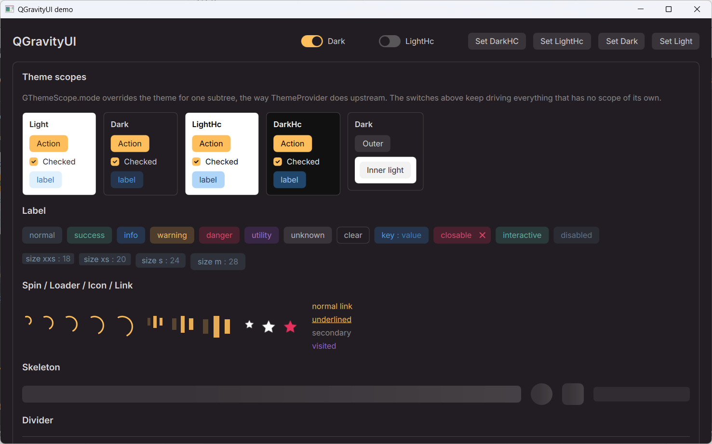
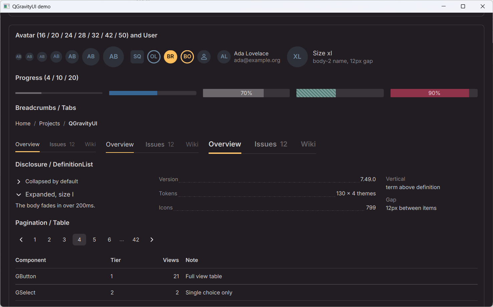
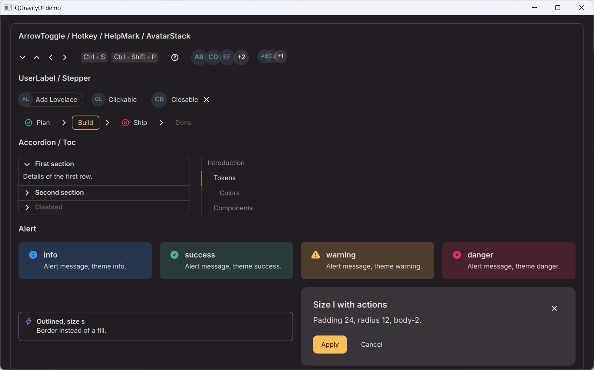
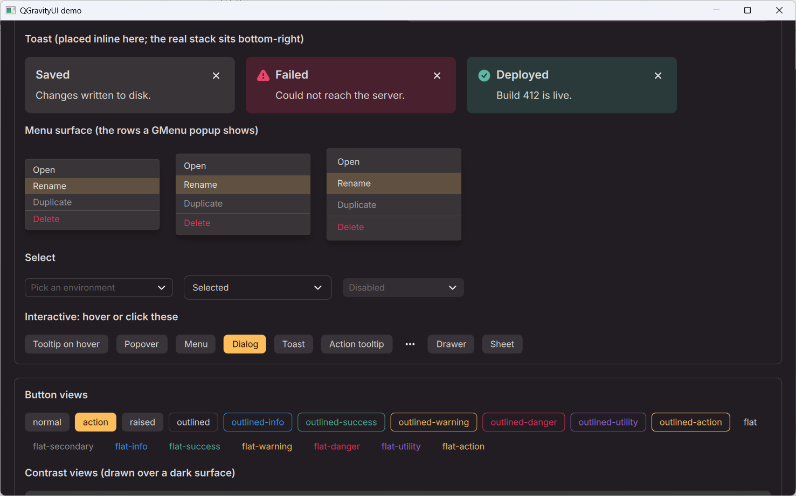
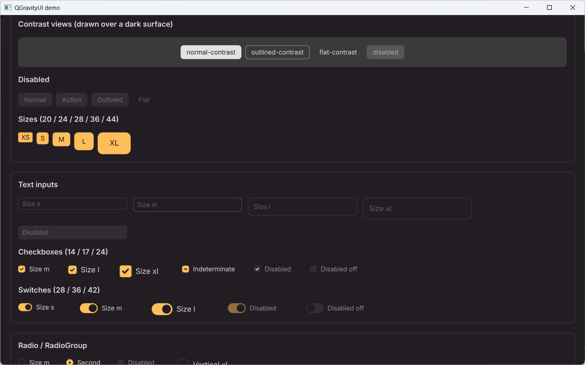

# QGravityUI

A QML component library that brings the [Gravity UI](https://gravity-ui.com)
design system to native Qt Quick 65 controls, four themes and the whole
token set, with no web engine and no React anywhere in the stack.

Token values are not transcribed from the documentation. They are extracted
from the published `@gravity-ui/uikit@7.49.0` package by the generators in
`tools/`, so a QGravityUI button is the same 28 pixels tall, with the same
`base-generic` fill and the same `line-focus` ring, as the web one.

> Not an official Gravity UI project an independent port. Gravity UI itself
> is developed at [gravity-ui/uikit](https://github.com/gravity-ui/uikit).


## Screenshots










## What is in the box

| | |
|---|---|
| Controls | 65 public types (`GButton`, `GTable`, `GDropdownMenu`, `GToaster`, …) |
| Themes | `light`, `dark`, `light-hc`, `dark-hc` — high contrast included |
| Tokens | 130 semantic colours × 4 themes, 18 typography steps, and the per-component metrics for 30 components, all generated from upstream CSS |
| Icons | 799 SVGs from `@gravity-ui/icons`, recoloured and HiDPI-correct |
| Typography | Inter 400/600 bundled (OFL) and self-registering — nothing to install |
| Keyboard | a `:focus-visible` ring: it appears for keyboard navigation, not for clicks |
| Theming | global or per-subtree (`GThemeScope`, the equivalent of `ThemeProvider`) |
| Tooling | Qt Design Studio metadata, `qmllint`-clean, compiled by `qmlsc` |
| Tests | 632 visual regression baselines across control × view × size × theme |

Requirements: **Qt 6.11+**, CMake 3.21+, a C++17 compiler.

## Adding it to your project

Two supported routes, each with a working sample project in `examples/`

### As a git submodule

```bash
git submodule add https://github.com/<you>/QGravityUI.git third_party/QGravityUI
```

```cmake
find_package(Qt6 6.11 REQUIRED COMPONENTS Core Gui Quick)
qt_standard_project_setup(REQUIRES 6.11)

add_subdirectory(third_party/QGravityUI)

qt_add_executable(app main.cpp)
qt_add_qml_module(app URI MyApp VERSION 1.0 QML_FILES Main.qml)

target_link_libraries(app PRIVATE Qt6::Quick QGravityUI)
```

That is the whole integration. `QGravityUI` is an INTERFACE target carrying
the four module libraries, their static QML plugins **and** the plugin init
objects, so there is no import path to configure and no `IMPORTS` list to
repeat. The individual targets (`qgravityui_core`, `qgravityui_tokens`,
`qgravityui_icons`, `qgravityui_controls`) are exported too, if you want only
part of it.

The library stays out of your build's way: the demo gallery and the test
runner are not built, `enable_testing()` is not called and no install rules
are generated — all three default to `PROJECT_IS_TOP_LEVEL`. The QML modules
are written under `<your-build>/third_party/QGravityUI/qml`, and that path
comes back as `QGRAVITYUI_QML_IMPORT_PATH` for tooling that wants it
(`qmllint`, `qmlls`, Qt Creator); building and running do not need it.

### As an installed package

```bash
cmake -S QGravityUI -B build -DCMAKE_BUILD_TYPE=Release
cmake --build build
cmake --install build --prefix /somewhere
```

```cmake
find_package(QGravityUI 0.4 REQUIRED)

target_link_libraries(app PRIVATE QGravityUI)

# Needed on this route: the modules live in the install tree, and
# qmlimportscanner finds their qmldir files only along the import path.
set_property(TARGET app APPEND PROPERTY
    QT_QML_IMPORT_PATH "${QGravityUI_QML_DIR}")
```

`examples/consumer` is a complete project that does exactly this;
`examples/submodule` is its `add_subdirectory` counterpart.

## Using it from QML

```qml
import QtQuick
import QGravityUI.Core
import QGravityUI.Tokens
import QGravityUI.Controls

Window {
    width: 480
    height: 220
    visible: true
    color: Theme.colors.baseBackground

    Column {
        anchors.centerIn: parent
        spacing: Metrics.spacing(4)

        GText { variant: GVariant.Header1; text: "Hello" }

        Row {
            spacing: Metrics.spacing(3)

            GButton {
                text: "Save"
                view: GView.Action
                icon.name: "floppy-disk"
                onClicked: toaster.add({title: "Saved", theme: GTheme.Success})
            }
            GButton { text: "Cancel"; view: GView.Outlined }
            GCheckbox { text: "Remember me"; checked: true }
        }

        GTextField { width: 260; placeholderText: "Search"; size: GSize.L }
    }

    GToaster { id: toaster; anchors.fill: parent }
}
```

That snippet is `examples/submodule/Main.qml` verbatim, so CI compiles and
runs the example on this page rather than trusting it.

`Theme.mode` is one of `GThemeMode.Light | Dark | LightHc | DarkHc` and
`Theme.toggle()` flips light and dark. To retheme one subtree instead of the
whole application, set `GThemeScope.mode` on the item at its root — nested
scopes resolve to the nearest ancestor with an opinion, the way CSS does.

Every enumerated property is a real C++ enum from `QGravityUI.Core`
(`GSize`, `GView`, `GTheme`, `GVariant`, `GShape`, …), so `view: GView.Acton`
is a `qmllint` error rather than a button that quietly looks ordinary.

## Components

**Primitives** - Text, Link, Icon, Divider, Flex, Label, Card, Surface,
Skeleton, Spin, Loader

**Forms** - Button, TextField, TextArea, NumberInput, PinInput, Checkbox,
Switch, Radio, RadioGroup, SegmentedRadioGroup, Slider, Select, ControlLabel,
ClipboardButton

**Overlays** - Popup, Popover, Tooltip, ActionTooltip, Menu, MenuItem,
DropdownMenu, Modal, Dialog, Drawer, Sheet, Toast, Toaster, Alert

**Data** - Table, TableColumnSetup, List, TreeList, TreeSelect, Progress,
DefinitionList, FilePreview, Palette, PlaceholderContainer, ActionsPanel,
Avatar, AvatarStack, User, UserLabel, Hotkey, HelpMark

**Navigation** - Tabs, Breadcrumbs, Pagination, Stepper, Toc, Accordion,
AccordionItem, Disclosure, ArrowToggle

## Building this repository

```bash
cmake -S . -B build -DCMAKE_BUILD_TYPE=Release
cmake --build build
./build/qgravityui_gallery                  # the component gallery
cmake --build build --target all_qmllint
ctest --test-dir build                      # 632 visual regression cases
```

| CMake option | Default | |
|---|---|---|
| `QGRAVITYUI_BUILD_EXAMPLES` | top-level only | the demo gallery |
| `QGRAVITYUI_BUILD_TESTS` | top-level only | the visual regression runner |
| `QGRAVITYUI_INSTALL` | top-level only | install rules |

## Repository layout

```
QGravityUI/
├── src/Core/            C++ module: enums, input mode, theme scope, clipboard
├── src/Tokens/          colours, typography, metrics (generated) + Inter
├── src/Icons/           799 SVGs and their catalogue (generated)
├── src/Controls/        the controls, plus Qt Design Studio metadata
├── examples/gallery/    the demo gallery, also the screenshot source
├── examples/consumer/   find_package() integration sample
├── examples/submodule/  add_subdirectory() integration sample
├── tests/visual/        regression runner and 632 baselines
├── tools/               token, metric and icon generators; screenshot helpers
└── docs/porting.ru.md   how each of these was ported, and why (Russian)
```

## Qt Design Studio

`src/Controls/designer/qgravityui_controls.metainfo` registers all 65 controls
in the component library, grouped as *QGravityUI – Primitives / Forms /
Overlays / Data / Navigation*. The modules declare `designersupported`, so the
Studio will instantiate the types.

## Regenerating the tokens

The generated files are committed, so a build never needs npm. To re-read a
newer upstream release:

```bash
npm pack @gravity-ui/uikit@7.49.0 && tar xzf gravity-ui-uikit-7.49.0.tgz
python tools/gen-tokens/gen_tokens.py   --package package
python tools/gen-metrics/gen_metrics.py --package package
python tools/gen-icons/gen_icons.py     --package icons
```

Each generator also takes `--check`, which reports a difference instead of
writing one: that is what CI runs to prove the committed output still matches
the package it claims to come from.

## Adding a component

1. Create `src/Controls/GNewThing.qml`, taking every colour, metric and type
   step from the `QGravityUI.Tokens` singletons.
2. Declare enumerated properties as `property int` with values from
   `QGravityUI.Core`, reusing an existing enum wherever one fits.
3. Add the file to `QML_FILES` in `src/Controls/CMakeLists.txt` and an entry
   to `src/Controls/designer/qgravityui_controls.metainfo`.
4. Add a case to `tests/visual/Cases.qml`, run the suite, read the diffs and
   commit the new baselines.
5. `cmake --build build --target all_qmllint` must stay clean.

Do not name a new type `Palette`: QtQuick exports that name already, and
qmllint will resolve it to theirs.

## Third-party material

- Inter (`src/Tokens/fonts/`) — SIL Open Font License 1.1, text included
- Colour values, component metrics and icons are derived from
  `@gravity-ui/uikit` and `@gravity-ui/icons` (MIT)